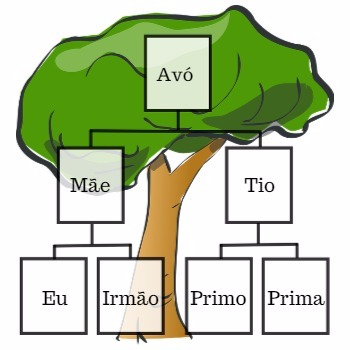

Faaaaaala, meus compilados!! Tudo suave com vocês?

O assunto de hoje é pra desmistificar um pouco sobre o **DOM** e deixar algumas referências importantes para auxiliar no dia a dia. Também vamos focar na diferença entre **DOM** e a API **HTML DOM**. Então *simbora* pro conteúdo, hoje tá mais curtinho.

---
## ./dom

> **DOM** (*aka* Document Object Model), ou **Modelo de Objeto de Documento**, é a representação dos objetos que compõem a estrutura e conteúdo de um documento na web.

Desenvolvedores web precisam estar bem familiarizados com esse termo e com as interações que são possíveis realizar. Afinal de contas, nosso trabalho é justamente cuidar das informações que estão na web.

A imagem abaixo é uma representação da *árvore* **DOM** de uma página qualquer na web. Talvez ela facilite o entendimento:

Compare a imagem com essa abaixo: 

> "Por que raios tem uma árvore genealógica aqui no blog?" 
> > Amigão, eu não faço ideia!

É importante que você preste atenção e faça a relação entre as duas imagens. Assim como em uma família existem os relacionamentos de pais, filhos, irmãos, primos, no **DOM** também temos esse relacionamento entre os elementos. Não vamos falar disso agora, mas é bom já ter isso em mente.

Vale lembrar que não estamos abordando ESPECIFICAMENTE o **HTML DOM** nem a **API Javascript**, e sim o contexto geral da interface.

É válido fazermos uma análise dessa imagem, degrau por degrau. A mentalidade de árvore é essencial para entender o fluxo que as informações se conectam nos objetos.

### **Window**

Quando um navegador vai exibir um documento (uma página HTML, por exemplo), essa página é "baixada" para a memória local e é exibida automaticamente na tela. Portanto, a brincadeira começa já no nosso navegador e nesse modelo que é salvo na memória local.

A partir do Window temos acesso a propriedades e métodos específicos, dentre essas estão as 3 que vamos citar abaixo. A lista é muito maior do que podemos discutir...

Em resumo, o topo da árvore é a janela aberta do nosso navegador.

### **Location, Document, History e +...**

O andar de baixo da nossa árvore, representa as propriedades que podemos acessar no nosso Window. Existem muito mais propriedades que apenas essas 3, mas são as que vamos citar nessa postagem (por causa da imagem de exemplo que achei kkk).

- **[Location](https://www.w3schools.com/jsref/obj_location.asp)**: Um objeto que contém informações sobre a URL em questão. Essas informações podem ser **propriedades** (*href*, *protocol*, *origin*, *host*, etc..) ou **métodos** ( *assign()*, *reload()*, *replace()* );
- **[History](https://www.w3schools.com/jsref/obj_history.asp)**: Objeto que contém as URLs visitadas pelo usuário, desde que essas URLs tenham sido visitadas com o browser e em condições normais de uso (sem guia fap-nônima, por exemplo). Possui a **propriedade** *lenght* e os **métodos** *back()*, *forward()* e *go()*;
- **[Document](https://www.w3schools.com/jsref/dom_obj_document.asp)**: Esse é o cara que interessa a gente! É a raiz do nosso HTML Document, repleto de propriedades e métodos que trazem luz (e muitas trevas) para o desenvolvimento. Vamos falar um pouco mais sobre o **HTML DOM** logo logo..

### **Elements**

Os **Elements object**, dentro do **HTML DOM** representam os elementos HTML (como um parágrafo, um título, uma tabela, um link, uma div, e qualquer outro elemento HTML).

Resumindo tudo que vimos até agora:

- **DOM** é uma forma de representar os documentos na web em forma de objetos;
- O **DOM** tem sua raiz mais profunda chamada de *Window*, que representa a janela do navegador aberto;
- Cada **objeto** no **DOM** tem suas *propriedades* e *métodos*;
- **DOM** !== **HTML DOM**;

Respire. Beba água.

Excelente começo para entrarmos de voadora no *mosh pit* do **HTML DOM**.

---
## ./html-dom

Quando falamos em **DOM** no ambiente de trabalho, normalmente estamos fazendo referência ao **HTML DOM** e todo seu ecossistema.

Para reforçar essa quantidade de termos e deixar os conhecimentos cada vez mais sólidos:
- **DOM** é a **FORMA DE REPRESENTAR**;
- O **DOM** possui interfaces de implementação, tais como Window, Element, Document, Node, e algumas outras que você vai descobrir acessando [aqui](https://developer.mozilla.org/en-US/docs/Web/API/Document_Object_Model#DOM_interfaces) (adoro links com anchor :stuck_out_tongue_closed_eyes:);
- **HTML DOM** é uma **API** que utiliza a implementação da interface **Document**;

Através desse **HTML DOM** que o JavaScript pode acessar, alterar, criar e remover (da página HTML):
  - Elementos;
  - Atributos;
  - CSS (estilo);
  - Eventos;

E não para por aí...

Os frameworks JavaScript (os **bons**, pelo menos) também possuem seu próprio sistema DOM, independente ao navegador. Aqui cabem alguns conceitos como [Shadow DOM](https://developer.mozilla.org/en-US/docs/Web/Web_Components/Using_shadow_DOM), [Virtual DOM](https://github.com/Matt-Esch/virtual-dom) e [Diferença entre DOM e Virtual DOM](https://pt.stackoverflow.com/questions/43169/qual-%C3%A9-a-diferen%C3%A7a-entre-dom-e-virtual-dom). Tô deixando de brinde pra vocês :smiley: ... mas não se limitem a eles, o contexto é muito mais profundo.

---
## ./links-uteis

Antes de concluir a postagem, vou deixar uma lista com alguns links das documentações.

Não se esqueçam de baixar o DevDocs como aplicação desktop, ele quebra um galho gigantesco na hora de otimizar as buscas. Eu falo mais dele e de outras ferramentas [nessa](https://pedro-mello.netlify.com/ambiente-dev/) postagem do blog.

- [Document Object Model(DOM) - MDN web docs](https://developer.mozilla.org/en-US/docs/Web/API/Document_Object_Model);
- [Introduction to the DOM - MDN web docs](https://developer.mozilla.org/en-US/docs/Web/API/Document_Object_Model/Introduction);
- [The HTML DOM API - MDN web docs](https://developer.mozilla.org/en-US/docs/Web/API/HTML_DOM_API);
- [What is the HTML DOM? - W3Schools](https://www.w3schools.com/whatis/whatis_htmldom.asp);
- [JavaScript HTML DOM - W3Schools](https://www.w3schools.com/js/js_htmldom.asp);
- [DOM - DevDocs](https://devdocs.io/dom/);
- [DOM Events - DevDocs](https://devdocs.io/dom_events/);

---
E chegamos ao final de mais uma postagem nesse blog informativo e irreverente. Eu busquei passar pra vocês uma visão geral sobre o **DOM** e puxei um gancho para a API do **HTML DOM**, que é a forma que o JavaScript interage com nosso documento HTML.

Obrigado, mais uma vez, por terem chego até aqui.
Continuem dando feedback e interagindo comigo. Quero trazer o que for melhor para todos :heart:.

Grande abraço, devs e !devs. Nos vemos daqui uns dias!!!
