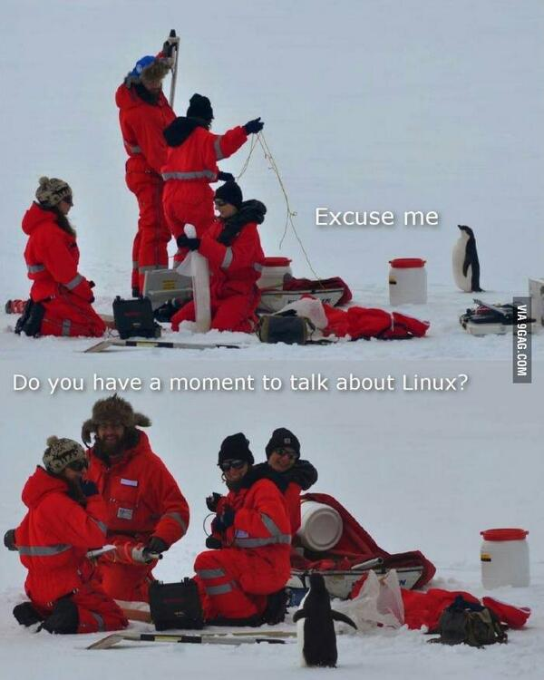

Faaaaaala sumidos, tudo bem com vocês?

Antes de mais nada, quero me desculpar pelo **meu** sumiço aqui no blog e explicar um pouco do que rolou nesses quase 2 meses.

Assim que o isolamento por conta do *COVID-19* começou, eu saí de São Paulo e vim correndo pra Juiz de Fora, pra fugir um pouco do risco e ficar com minha noiva e família. Trouxe apenas meu notebook do trabalho e as postagens estavam commitadas localmente no meu notebook pessoal. Consegui voltar em São Paulo no meio dessa semana que passou para resolver algumas questões da mudança de apartamento e aproveitei para pegar meu notebook.

Tenho uma série de 3 partes sobre React pronta pra soltar e uma sobre Angular com o escopo ok pra começar a desenvolver. Essa semana (sexta pra sábado) vou soltar a primeira parte do React, além desse post aqui.

---

O post de hoje é, na verdade, uma listagem de dicas pra te ajudar a aprimorar seus conhecimentos durante esse período de isolamento social. Não deixem de estudar e focar nos seus objetivos por conta dos tempos difíceis...as empresas **NÃO PARAM!** Não parem as buscas e continuem dedicando, tenho certeza que aquela vaga bacana pode pintar logo logo.

Bom, eu sei que existem vários sites e canais oferecendo assinatura/acesso por tempo limitado, mas senti falta de alguns conteúdos que são básicos e que auxiliam principalmente quem está começando.

Bora pros tópicos então! Espero que gostem e me perdoem pelo sumiço. :)

---
## ./sistema-operacional

A primeira dica, e talvez a mais importante, é pra te encorajar a fazer um dual boot ou colocar uma máquina virtual com um sistema operacional diferente.

Se você nunca experimentou usar um sistema operacional *Unix like*, como o Linux, essa é sua chance! É um dos aprendizados mais enriquecedores que você vai ter.

Se você já usa Linux, talvez seja a hora perfeita pra testar uma distro nova.

Aqui vai uma lista pessoal de algumas distros pra vocês escolherem:
- [Ubuntu](https://ubuntu.com/);
- [Mint](https://www.linuxmint.com/);
- [Manjaro](https://manjaro.org/);
- [Fedora](https://getfedora.org/pt_BR/);
- [Deepin](https://www.deepin.org/en/);

Pro mais manjões, existem muitos tutoriais pra fazer um *[Hackintosh](https://hackintosh.com/)* (resumidamente, colocar um macOS em um computador que não é da Apple). Nunca fiz, já tive vontade mas o procedimento é bem trabalhoso. Quem já tiver feito e quiser dar um alô com umas dicas, me chama em um dos meus contatos.

---
## ./hackerman-do-terminal

Outra dica de ouro, pegando gancho no tópico acima, é treinar os comandos de terminal. Automatizar seus comandos do dia a dia, criar *alias* diferentões, fazer um script no cron pra agendar umas tarefas, são algumas das inúmeras coisas que você pode fazer.

A linha de comando é o maior aliado de um desenvolvedor, e com certeza ela vai fazer parte do seu dia a dia, mais cedo ou mais tarde. É claro que as ferramentas visuais vieram justamente para facilitar nossa vida, mas muitas vezes elas acabam se tornando muletas no nosso dia a dia e nos esquecemos do básico.

Recomendo **[esse](https://www.youtube.com/watch?v=yz7nYlnXLfE)** *crash course* da [freeCodeCamp](https://freecodecamp.org) pra vocês. Outros dois materiais para os aventureiros: [Viking Code School](https://www.vikingcodeschool.com/web-development-basics/a-command-line-crash-course) e [Open Classrooms](https://openclassrooms.com/en/courses/4614926-learn-the-command-line-in-terminal).

Lembrando que já fiz um post que fala um pouco sobre terminal, o link tá [aqui](https://pedro-mello.netlify.com/terminal-ide-editor/).

---
## ./aprendizado-gamificado

A dica agora é sobre as plataformas que oferecem um sistema gamificado de aprendizado. Além de auxiliarem muito na prática de algoritmos, algumas das plataformas oferecem sistema de mentoria, comunidade aberta e são usadas por empresas durante os processos seletivos. Se liga:

### **HackerRank**

Uma excelente plataforma pra auxiliar nos estudos. Além de proporcionar desafios diários de código, base sólida para aprofundar em algoritmos, ela é muito utilizada por empresas durante processos seletivos.

O HackerRank possui alguns desafios como [#30DaysOfCode](https://www.google.com/search?q=30+days+of+code) e [#10DaysOfJS](https://www.google.com/search?q=10+days+of+js), que são um impulso no seu hábito diário de programar.

Pra acessar, basta criar sua conta e usufruir de todo o conteúdo.

*Link: [https://www.hackerrank.com/](https://www.hackerrank.com/)*

### **CodeWars**

Outro site excelente pra treinar os conhecimentos. O Code Wars oferece um progresso gamificado que varia conforme seu desempenho nos desafios. Resumindo: quanto mais você avança, mais vai ser exigido nos desafios!

A lista de desafios e linguagens de programação que o Code Wars possui é maior que o HackerRank, porém eu senti que a comunidade do HackerRank é mais receptiva que a do Code Wars no quesito de tirar dúvidas nas soluções dos desafios. Testa os dois e me fala o que achou :D

*Link: [https://www.codewars.com/](https://www.codewars.com/)*

### **Exercism**

Um pouco menos focado nesse lance de progressão gamificada e desafios, o Exercism surge com uma ideia de uma mentoria gratuita prometendo sua fluência na linguagem de programação desejada.

Eu acessei e gostei bastante do que vi. Apesar do foco ser grande na mentoria, a gamificação dele é progressiva e se assemelha muito ao HackerRank. Fica a dica aí!

*Link: [https://exercism.io/](https://exercism.io/)*

---
## ./joguinhos

> Sério isso?
>> Claro, imbecil! Aprender e se divertir ao mesmo tempo é a melhor forma!

É isso mesmo: jogos! Essa é uma listinha de alguns jogos que eu tenho criar o hábito de jogar pelo menos uma vez por semana pra auxiliar na fixação do conteúdo. São bem voltados pra CSS, que é minha maior dificuldade, e são ajudam muito a lembrar alguns conceitos.

### **Flexbox Froggy**

Desenvolvido pela [Codepip](https://codepip.com/), os primeiros dois jogos da lista são os meus favoritos. Como eu disse, minha maior dificuldade é com CSS, e o jogo me ajuda a justamente não ficar chutando o que usar na hora de posicionar os elementos na tela.

São poucas fases, e rapidinho pega o jeito. Ele ajuda muito a fixar os conceitos básicos de flexbox.

*Link: [https://flexboxfroggy.com/](https://flexboxfroggy.com/)*

### **Grid Garden**

Também desenvolvido pela  [Codepip](https://codepip.com/), esse tem o foco no posicionamento utilizando o sistema de grid.

*Link: [https://cssgridgarden.com/](https://cssgridgarden.com/)*

### **Flexbox Defense**

Outro jogo com foco em flexbox, mas um pouco mais dinâmico. É um tower defense que você precisa utilizar os conceitos de flexbox para posicionar as torres de defesa.

*Link: [http://www.flexboxdefense.com/](http://www.flexboxdefense.com/)*

### **CSS Diner**

O último da lista é pra fixar os conceitos de seletores de CSS. A riqueza de aprendizado desse jogo é gigantesca, e normalmente é um conceito que passamos batido no dia a dia. Fica a dica!

*Link: [http://flukeout.github.io/](http://flukeout.github.io/)*

---

## ./podcasts

Um manancial de conhecimento que muitos desenvolvedores ignoram, os podcasts são ótimos para aprender. Nele, você tem informações técnicas, opiniões e discussões sobre as tecnologias e casos de uso no dia a dia, pelas palavras de outros desenvolvedores.

Minha lista de podcasts:
- [DEVNAESTRADA](https://devnaestrada.com.br/);
- [Fala Dev](https://podcasts.google.com/?feed=aHR0cHM6Ly9hbmNob3IuZm0vcy8zYmYyZjJjL3BvZGNhc3QvcnNz&ved=0CAAQ4aUDahcKEwjI9PXe5tToAhUAAAAAHQAAAAAQAQ&hl=pt-BR);
- [Hipsters.tech](https://hipsters.tech/);
- [Cabeça de Lab](http://www.cabecadelab.com.br/);
- [Quebra Dev](https://quebradev.com.br/);

---

A dica principal desse post é: **FIQUE EM CASA**.

Estude, se hidrate bem, durma bastante, coma bem, aproveite o tempo para fazer coisas produtivas. A ansiedade é seu pior inimigo nesse momento, então crie uma rotina para suas tarefas e mantenha a cabeça no lugar.

Juntos vamos passar por essa crise!

Como já disse o [MC Rayban](https://twitter.com/delucca/status/1245700401724342274):

> O Brasil tá unido e decidiu o seguinte: não tem mole pra COVID 19 nem 20. #FicaEmCasa

Valeu, moçada. Um abraço e se cuidem!