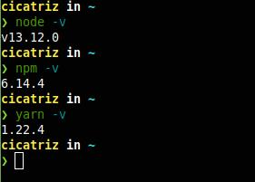
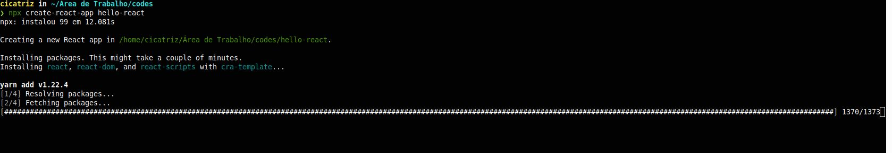
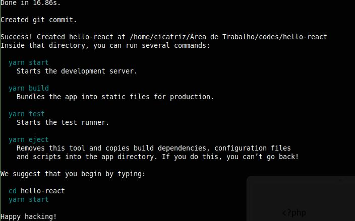
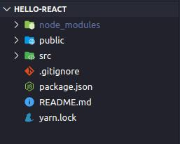
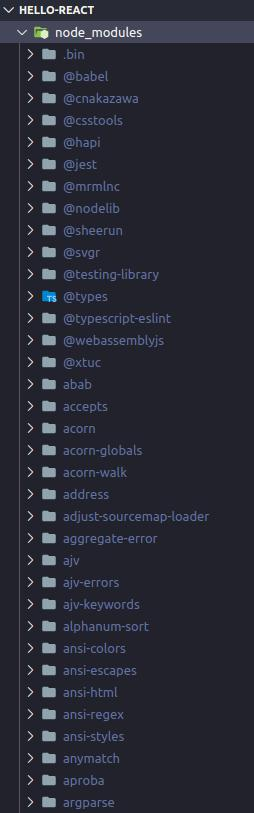
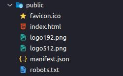
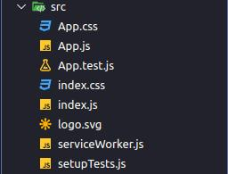
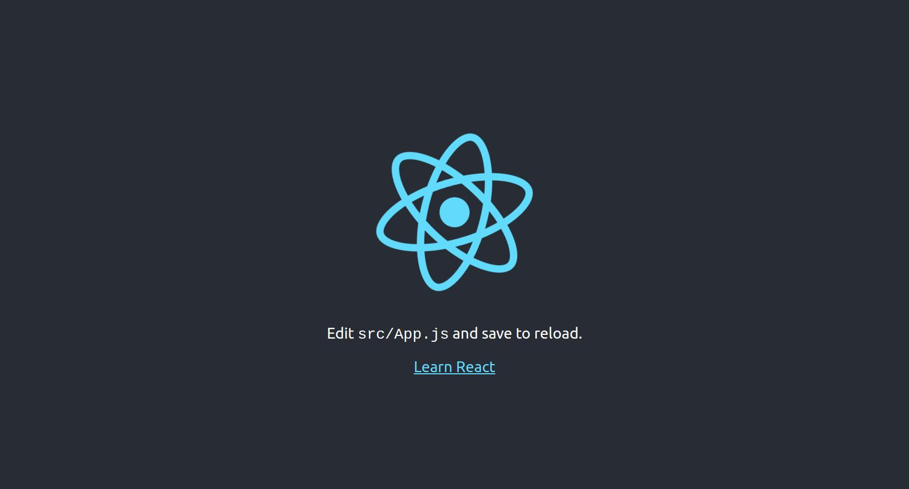
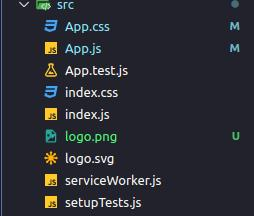
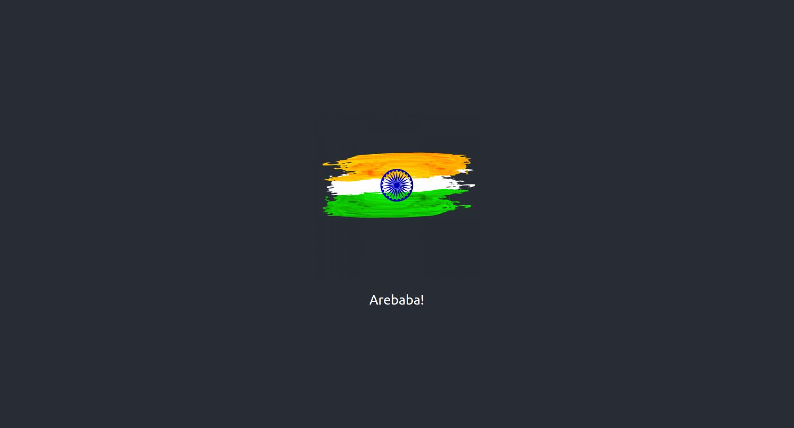

Fala, meus bruxos e bruxas da tecnologia!

Hoje vamos introduzir o React e alguns conceitos muito importantes sobre seu ecossistema. Essa é a primeira parte de uma série de 3 postagens.

Nesse post, em especial, vamos falar um pouco sobre:
- Requisitos pra conseguir utilizar a biblioteca;
- Utilizar um `runner` do npm para iniciar um projeto com algumas configurações prontas;
- Entender a estrutura e os arquivos que ele cria para nós;
- Fazer algumas alterações e ver o reflexo em tempo real na aplicação;
- Dar uma olhada na sintaxe *diferente* do Javascript, que torna as interações no DOM mais dinâmicas e descomplicadas.

Bora comigo, então!!

---
## ./requisitos

Basicamente, tudo que você precisa é de uma versão mais recente do [Node](https://nodejs.org/pt-br/) instalada, seu editor de texto favorito e um terminal bem configurado.

> Já falei de terminal e editores de texto em outro post, clica [AQUI](https://pedro-mello.netlify.com/terminal-ide-editor/) pra ver lá.

Eu utilizo uma distro baseada no Ubuntu, então segui o passo a passo de acordo com meu caso. Para outras distros, segue esse [link](https://github.com/nodesource/distributions/blob/master/README.md) que é sucesso.

Se você utiliza Windows ou macOS, acessa a [central de downloads](https://nodejs.org/pt-br/download/) do site oficial.

O passo a passo abaixo serve para quem vai instalar via linha de comando e possui um sistema operacional Unix baseado no Ubuntu/Debian.

Eu digitei os seguintes comandos no meu terminal:

```bash
curl -sL https://deb.nodesource.com/setup_13.x | sudo -E bash -

sudo apt install -y nodejs

sudo apt install gcc g++ make
```

Aproveitei para instalar o Yarn, mas esse passo é opcional:

```bash
curl -sL https://dl.yarnpkg.com/debian/pubkey.gpg | sudo apt-key add -

echo "deb https://dl.yarnpkg.com/debian/ stable main" | sudo tee /etc/apt/sources.list.d/yarn.list

sudo apt update && sudo apt install yarn
```

Se tudo tiver dado certo, você deve ser capaz de digitar os comandos para checar as versões instaladas:

```bash
node -v
npm -v
yarn -v
```

Seu resultado provavelmente vai ser algo parecido com o meu aqui:



De agora em diante, o tutorial volta a ser o mesmo para todos. Independente do seu sistema operacional, você deve ser capaz de verificar as versões do Node e Npm/Yarn pelo seu terminal para prosseguir.

---
## ./hello-react

A forma mais fácil de iniciar um projeto em React é utilizando o *package runner* NPX, que vem junto do NPM (nas versões 5.2+)

Vou criar um projeto chamado **hello-react**, portanto o comando fica assim: 

```bash
npx create-react-app hello-react
```

O terminal exibirá um log como esse, de inicio:



Ele utilizou o yarn, nesse caso, pois eu fiz a instalação e é uma preferência minha. Se você estiver usando o npm, não tem problema nenhum e vai dar tudo certo :)

Todas as dependências do projeto serão instaladas automaticamente. Se não houver nenhum erro, o log final será mais ou menos assim:



O comando **create-react-app** vem com algumas pré-configurações que são legais para quem ta começando, ou para quem não pretende personalizar muito as configurações do projeto. Se você quiser configurar TUDO na mão e utilizar o **create-react-app** apenas para gerar os arquivos e estrutura iniciais, basta rodar o comando ``yarn eject``. Porém, tome cuidado! É um procedimento irreversível.

Os outros comandos, em ordem, são:
- ``yarn start``
  - Inicia o servidor de desenvolvimento.
- ``yarn build``
  - Builda todos os arquivos para uma versão de produção.
- ``yarn test``
  - Executa o runner de teste (se estiver configurado).

Agora que já temos uma visão geral dos comandos que vem configurados por default, é hora de entrar no diretório e abrir ele com seu editor de texto para verificar os arquivos que foram criados.

Para isso, eu digitei no terminal:

```bash
cd hello-react

code .
```

Utilizo o [Visual Studio Code](https://code.visualstudio.com/), e esse último comando abre o diretório atual em uma nova janela do editor de texto. Se você utiliza outro editor ou uma IDE, verifique se ele possui algum atalho ou abra manualmente pela interface gráfica do programa.

---
## ./estrutura-de-arquivos



Essa é a estrutura inicial do nosso projeto, ou seja, os arquivos e diretórios que o **create-react-app** criou para nós.

Vamos entender, nível por nível, o que são cada uma dessas coisas.

----
### Pasta Raiz

Dentro dessa pasta, temos os seguintes arquivos:

- ``.gitignore``
  - Arquivo de texto que podemos listar os arquivos e diretórios que serão ignorados pelo watcher do git (assunto para outro post específico sobre Git)
- ``package.json``
  - Arquivo que contém as informações do projeto e as dependências dele. É esse arquivo que o NPM e o YARN utilizam.
- ``README.md``
  - Arquivo formatado com *markdown*, utilizado normalmente para descrever o projeto e suas dependências. Nos repositórios de Git, é ele que faz a "folha de rosto" do projeto.
- ``yarn.lock``
  - Arquivo de log relacionado ao ``package.json``

É, também, na pasta raiz que temos acesso as demais pastas do nosso projeto.

----
### node_modules



É a pasta que contém as dependências instaladas do nosso projeto. Pela imagem acima, conseguimos ter uma noção da quantidade de arquivos e do tamanho que ela deve ter.

Justamente por isso que existe o arquivo ``package.json``, que contém as informações de todas essas dependências para serem instaladas em diferentes computadores.

Já imaginou se a gente tivesse que passar o projeto para outra pessoa por pendrive por causa da limitação de espaço em um servidor git?

Quando executamos um `npm install` ou `yarn install` no diretório que contém um arquivo `package.json`, o *runner* vai ler esse arquivo e instalar automaticamente o projeto com suas dependências. Graças a isso, é possível que várias pessoas trabalhem simultaneamente com o mesmo projeto, sem se preocuparem, pois basta subir uma alteração para o servidor git e todos que tem acesso ao projeto terão o código e as dependências atualizadas.

Um dia eu volto com uma postagem detalhando melhor o funcionamento desses gerenciadores, mas por hora essa explicação deve servir.

----
### public



Nesse diretório estão os arquivos que serão lidos pelo navegador. O ``favicon.ico``, por exemplo, é o ícone que fica na aba que o site está aberto.

A estrutura do `index.html` tem a referência que precisamos para nosso código React funcionar: um `id` na tag do body que será lido no React para implantar o que desenvolvermos.

```html
<!DOCTYPE html>
<html lang="en">
  <head>
    <meta charset="utf-8" />
    <link rel="icon" href="%PUBLIC_URL%/favicon.ico" />
    <meta name="viewport" content="width=device-width, initial-scale=1" />
    <meta name="theme-color" content="#000000" />
    <meta
      name="description"
      content="Web site created using create-react-app"
    />
    <link rel="apple-touch-icon" href="%PUBLIC_URL%/logo192.png" />
    <!--
      manifest.json provides metadata used when your web app is installed on a
      user's mobile device or desktop. See https://developers.google.com/web/fundamentals/web-app-manifest/
    -->
    <link rel="manifest" href="%PUBLIC_URL%/manifest.json" />
    <!--
      Notice the use of %PUBLIC_URL% in the tags above.
      It will be replaced with the URL of the `public` folder during the build.
      Only files inside the `public` folder can be referenced from the HTML.

      Unlike "/favicon.ico" or "favicon.ico", "%PUBLIC_URL%/favicon.ico" will
      work correctly both with client-side routing and a non-root public URL.
      Learn how to configure a non-root public URL by running `npm run build`.
    -->
    <title>React App</title>
  </head>
  <body>
    <noscript>You need to enable JavaScript to run this app.</noscript>
    <div id="root"></div>
    <!--
      This HTML file is a template.
      If you open it directly in the browser, you will see an empty page.

      You can add webfonts, meta tags, or analytics to this file.
      The build step will place the bundled scripts into the <body> tag.

      To begin the development, run `npm start` or `yarn start`.
      To create a production bundle, use `npm run build` or `yarn build`.
    -->
  </body>
</html>
```

Voltaremos nessa parte mais tarde para explicar mais profundamente como o código em React é passado para nosso browser. Mas já pode adiantar um pouco lendo minha postagem sobre DOM, nesse link [aqui](https://pedro-mello.netlify.com/dom-not-doom/).

----
### src



Nosso código React mora aqui (pelo menos à princípio, rs).

A estrutura inicial do nosso código é bem básica, existem várias ações que podemos adotar, visando boas práticas no nosso código.

Vamos focar em fazer algumas alterações em arquivos para ver como reflete no nosso servidor local de desenvolvimento.

Antes de mais nada, roda um `yarn start` ou `npm start` aí no terminal, dentro do diretório do projeto. Se o browser não abrir automaticamente, verifica o log no terminal ou acessa http://localhost:3000/ .



Tu deve estar vendo a logo do React girando e esses escritos abaixo. Certo? Vamos fazer algumas alterações e deixar a coisa mais legal.

Primeiro vamos ver de qual arquivo ta vindo isso.

**App.js**
```javascript
import React from 'react';
import logo from './logo.svg';
import './App.css';

function App() {
  return (
    <div className="App">
      <header className="App-header">
        
        <p>
          Edit <code>src/App.js</code> and save to reload.
        </p>
        <a
          className="App-link"
          href="https://reactjs.org"
          target="_blank"
          rel="noopener noreferrer"
        >
          Learn React
        </a>
      </header>
    </div>
  );
}

export default App;

```

> COMO ASSIM TEM CÓDIGO HTML E JAVASCRIPT JUNTO?
> > Calma, que no próximo tópico eu vou te explicar...

Vamos começar trocando a logo do React por algo mais legal, e trocar os escritos.

Deixa o seu código como o meu aqui:

```javascript
import React from 'react';
import logo from './logo.svg';
import './App.css';

function App() {
  return (
    <div className="App">
      <header className="App-header">
        
        <p>
          Arebaba!
        </p>
      </header>
    </div>
  );
}

export default App;
```

Salva o arquivo e corre no navegador. Mudou, né? Esse é um recurso do **create-react-app** para atualizar o código em tempo real, assim que alguma alteração é efetuada e salva.

Agora vamos trocar esse logo do React rodando na tela. Vai no arquivo ``App.css`` e deixa ele como o meu:

```css
.App {
  text-align: center;
}

.App-logo {
  height: 40vmin;
  pointer-events: none;
}

.App-header {
  background-color: #282c34;
  min-height: 100vh;
  display: flex;
  flex-direction: column;
  align-items: center;
  justify-content: center;
  font-size: calc(10px + 2vmin);
  color: white;
}

.App-link {
  color: #61dafb;
}
```

Se tu voltar no navegador, a logo parou de girar.

Agora vamos trocar a logo. Salva essa imagem aqui:


Salva ela como ``logo.png`` na pasta src:



Agora volta no seu arquivo `App.js`, remove a importação da logo antiga e coloca a nova. Seu código deve ficar igual o meu:

```javascript
import React from 'react';
import logo from './logo.png';
import './App.css';

function App() {
  return (
    <div className="App">
      <header className="App-header">
        
        <p>
          Arebaba!
        </p>
      </header>
    </div>
  );
}

export default App;
```

O resultado final é algo parecido com isso aqui:



Pode parecer bobagem isso que fizemos, mas vamos recapitular o processo todo:
1. Criamos um projeto com o *runner* **NPX**, através do comando ``npx create-react-app nome-da-aplicação``;
2. Conhecemos a estrutura de arquivos que o **create-react-app** cria;
3. Identificamos cada pasta e seu significado;
4. Fizemos algumas alterações e presenciamos o reflexo automático na nossa aplicação.
5. **Vimos um código estranho, com HTML e Javascript junto**

E é sobre esse último ponto que vamos falar agora, pra encerrar o conteúdo de hoje.

---
## ./jsx

Essa estranha sintaxe, misturando Javascript e HTML no mesmo arquivo é chamada de JSX.

> Na verdade, o HTML nos arquivos Javascript não é exatamente HTML...


Essa é uma extensão de sintaxe do Javascript, que permite escrever elementos do React através do DOM.

O JSX caiu como uma luva para quem queria deixar a renderização mais dinâmica e centralizada em um arquivo só. No mesmo arquivo Javascript é possível ter a lógica (Javascript), os elementos UI (HTML) e a estilização (CSS). Talvez pareça complicado nesse primeiro momento

> Lembra do DOM? Artigo nesse link [aqui](https://pedro-mello.netlify.com/dom-not-doom/).

Se você ainda está confuso sobre o JSX ou não se sente seguro sobre o funcionamento dele, vou deixar essa palestra (em inglês) que a própria doc do React recomenda.

[](http://www.youtube.com/watch?v=x7cQ3mrcKaY).

----

Na próxima postagem dessa série, vou explicar melhor como funciona a renderização do React (Virtual DOM) e aprofundar um pouco mais nos conceitos que já vimos até agora.

Teremos um repositório específico para os próximo códigos, pra não ficar executando o `npx create-react-app` toda vez.

Espero que tenham gostado e espero que tenham entendido pelo menos um pouco do que eu quis passar aqui.

Qualquer dúvida ou comentários adicionais, me chamem em uma das minhas redes.

Um grande abraço para todos, devs e !devs que acompanham e sempre tem um carinho enorme comigo. Nos vemos daqui uns dias.

Lembrando: **#FiqueEmCasa** e **#EstudeComigo**.

**\o/**

Doc oficial do React (traduzida pela comunidade): https://pt-br.reactjs.org/docs/getting-started.html

Doc do W3Schools: https://www.w3schools.com/react/default.asp

Repositório oficial do React, mantido pelo Facebook: https://github.com/facebook/react