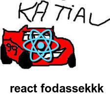

~ passadinha de álcool em gel na mão ~

Olá, humanxs! Tudo bem? Hoje trago para vós a segunda parte dessa série de postagens introdutórias sobre o React, e as coisinhas que você precisa saber antes de entrar de cabeça no desenvolvimento de projetos mais complexos com ele.

Na primeira postagem, nós falamos um pouco sobre os conceitos de JSX e fizemos algumas alterações no código. Além disso, olhamos cada diretório que o comando `create-react-app` cria para nós e a estrutura da configuração do React.

Nossa missão hoje é entender o Virtual DOM e também vermos como manipular dados no React utilizando `states` e também `props`.

Tenho uns slides que utilizei para uma pequena talk no Itaú no ano passado.
São slides de consulta para não usar papel com colinha, então não possuem alto nível de explicação ou detalhes, mas o link para acessar eles tá [aqui](http://slides.com/pedromello/horizontata-react).

---
## ./virtual-dom

> "Por quê o React é tão rápido??

A grande afirmação que todos pregam (sim, eu vim pra tretar, mesmo com os apóstolos de React) é que **O REACT É MAIS RÁPIDO QUE OS OUTROS FRAMEWORKS** #ChupaAngular

**Representação do React ganhando a Copa Pistão*

MEOA MIGO, não existe "framework mais rápido". Passou da hora de tirar essa camiseta da empresa X e Y aí e encarar a realidade: o desenvolvedor que torna as coisas boas e ruins, rápidas e lentas, utéis e engessadas.

O Virtual DOM não é um néctar dos deuses, concedido somente ao React, dá uma ligada nesse tópico [aqui](https://pt.stackoverflow.com/questions/43169/qual-%C3%A9-a-diferen%C3%A7a-entre-dom-e-virtual-dom) do stackoverflow (mais precisamente no final da primeira resposta). Tem uma listinha de frameworks e libs que utilizam o dito-cujo. 

> MAS O QUE QUE É ESSE CARA AÍ, MEU?? Para de enrolar!

O Virtual DOM é uma **representação virtual** da nossa UI mantida em memória e sincrozinada em tempo real com o DOM (que já discutimo no meu post sobre DOM, link [aqui](https://pedro-mello.netlify.app/dom-not-doom/)).

Esse camarada, mantido em memória virtual, trás algumas melhorias significativas que tornam a experiência mais rápida.

Ou seja, não é o React que é mais rápido, é a **forma que DOM é manipulado** que torna a *experiência mais rápida*.