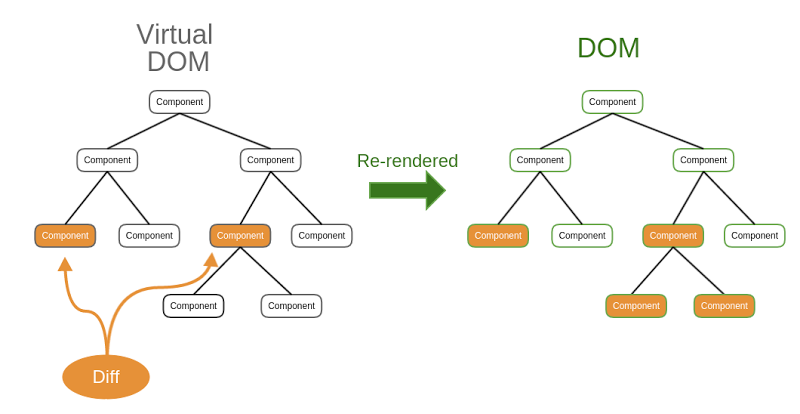

~ passadinha de álcool em gel na mão ~

Fala aí, internet! Tudo bem? Hoje trago a segunda parte dessa série de postagens introdutórias sobre o React, e as coisinhas que você precisa saber antes de entrar de cabeça no desenvolvimento de projetos mais complexos com ele.

Na primeira postagem, nós falamos um pouco sobre os conceitos de JSX e fizemos algumas alterações no código. Além disso, olhamos cada diretório que o comando `create-react-app` cria para nós e a estrutura da configuração do React.

Nossa missão hoje é entender o Virtual DOM, o processo de componentização e o conceito de `props`.

Tenho uns slides que utilizei para uma pequena talk no Itaú em 2019.
São slides de consulta para não usar papel com colinha, então não possuem alto nível de explicação ou detalhes, mas o link para acessar eles tá [aqui](http://slides.com/pedromello/horizontata-react).

---
## ./virtual-dom



> "Por quê o React é tão rápido??
>> Será que o "React é tão rápido" mesmo?

A pergunta deveria ser: o que TORNA o "React rápido"?


**Representação do React ganhando a Copa Pistão*

MEOA MIGO, não existe "framework mais rápido". Passou da hora de tirar essa camiseta da empresa X e Y aí e encarar a realidade: o desenvolvedor que torna as coisas boas e ruins, rápidas e lentas, úteis e engessadas.


O Virtual DOM não é um néctar dos deuses, concedido somente ao React, dá uma ligada nesse tópico [aqui](https://pt.stackoverflow.com/questions/43169/qual-%C3%A9-a-diferen%C3%A7a-entre-dom-e-virtual-dom) do stackoverflow (mais precisamente no final da primeira resposta). Tem uma listinha de frameworks e libs que utilizam o dito-cujo. 

> MAS O QUE QUE É ESSE CARA AÍ, MEU?? Para de enrolar!

O Virtual DOM é uma **representação virtual** da nossa UI mantida em memória e sincronizada em tempo real com o DOM (que já discutimos no meu post sobre DOM, link [aqui](https://pedro-mello.netlify.app/dom-not-doom/)).

Esse camarada, mantido em memória virtual, trás algumas melhorias significativas que tornam a experiência mais rápida. 

Ao fazer uma modificação no DOM real, ele vai percorrer toda a árvore do DOM antes de gerar uma cópia atualizada. Utilizando o Virtual DOM, ele possui uma identificação única de cada nó do DOM real e, ao ser modificado, ele sabe exatamente onde ir e não precisa percorrer todo o DOM para gerar a cópia atualizada.

Ou seja, não é o React que é mais rápido, é a **forma que DOM é manipulado** que torna a *experiência mais rápida*.

A aplicação do Virtual DOM é muito mais complexa que seu conceito, e vamos ver isso na prática no decorrer dos nossos estudos e enquanto estivermos codando. Por hora, fique com o conceito acima.

---
## ./components

Já sabemos como funciona a manipulação do Virtual DOM no DOM real, mas ainda não sabemos como manipular os dados do React e é isso que vamos ver agora.


Essa imagem eu tirei dos slides que disponibilizei o link lá em cima. Ela descreve o **"Data Flow"** do React, com indicações do que seriam as props e do que seriam o states.

A partir desse momento, outro conceito precisa ficar bem claro para nós: o de ***componentização***.

Componentização é abstrair o conceito de um todo em pequenas partes que o compõem. Em outras palavras: é dividir em pequenas partes únicas o contexto total.

Confuso, né? Vamos exemplificar:


Utilizando o relâmpago marquinhos para o exemplo, notamos que ele é um carro. O carro é a representação final da junção de várias *peças* e *componentes* que ele possui. Volantes, pneus, bancos, motor e vidros, são exemplos dos **COMPONENTES** do carro.

No React, nossos componentes são representados por meio de uma função em JavaScript.

```javascript
function Pneu() {
  return <p> Eu sou um Pneu! </p>
}

function Volante() {
  return <p> Eu sou um volante! </p>
}

// demais componentes do carro
// ..

function Carro() {
  return (
    <div>
      <Pneu />
      <Pneu />
      <Pneu />
      <Pneu />
      <Volante />
      <DEMAIS_COMPONENTES />
    </div>   
  )
}
```

**com* ES6 nossas `functions` podem ser substituídas por **funções anônimas**, ficando algo parecido com:
```javascript
const Pneu = () => <p> Eu sou um Pneu </p>
```

> Tá, mas como vou saber qual pneu é do lado direito, esquerdo, etc?

E aí que entram as props, meu amigo!

---
## ./props

Props: são os parâmetros que seu componente recebe. No React, com o JSX, já temos alguns parâmetros como o `className`, `onClick` e muitas outras que herdamos da biblioteca. São as props *nativas*, se é que posso chamar assim (me perdoa, comunidade). Mas temos liberdade de criarmos nossas próprias props, e é isso que nos interessa agora.

Vamos modificar o mesmo trecho de código acima, utilizando ES6 e o conceito de props.

```javascript
const Pneu = (props) => {
  return <p> Eu sou o pneu {props.parte} do lado {props.lado} </p>
}

const Volante = () => <p> Eu sou um volante! </p>

// demais componentes do carro
// ..

const Carro = () => {
  return (
    <div>
      <Pneu 
        parte="frontal"
        lado="direito"
      />
      <Pneu 
        parte="frontal"
        lado="esquerdo"
      />
      <Pneu 
        parte="traseiro"
        lado="direito"
      />
      <Pneu 
        parte="traseiro"
        lado="esquerdo"
      />
      <Volante />
    </div>   
  )
}
```
Link do JSFiddle com o exemplo [aqui](https://jsfiddle.net/cicatrzwp/9t4msbna/).

Todos os componentes React tem que agir como funções puras em relação ao seus props. Ou seja, independente de quantas props você passe, elas devem seguir a boa prática de serem SOMENTE para leitura, sem sofrer alterações no seu valor inicial. 

Se você deseja passar dados que são dinâmicos e mudam com o tempo, na próxima postagem vamos abordar o conceito de `states` e o ciclo de vida de um componente.


---


Qualquer dúvida ou comentários adicionais, me chamem em uma das minhas redes.

Quem me acompanha, sabe um pouco do que rolou nesse tempo, desde a última postagem até essa semana. Prometi que seria mais ativo, mas infelizmente não deu. As coisas estão se acertando e aos poucos estou voltando com as atividades normais.

Um grande abraço para todos, devs e !devs.

Nos vemos em breve!
