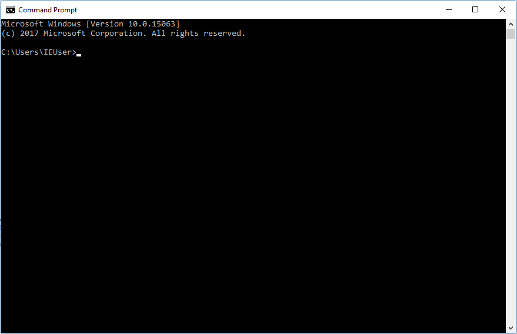
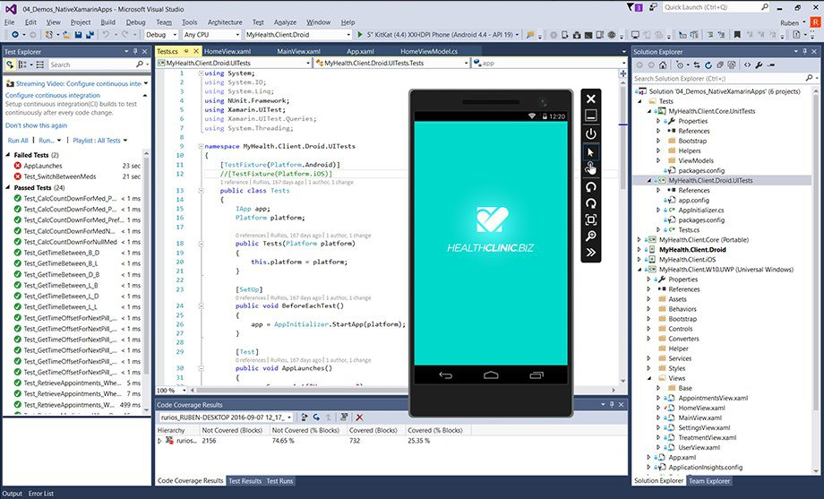
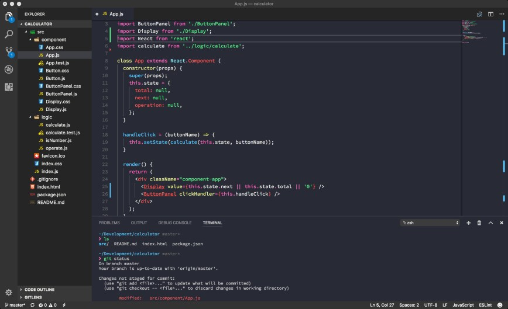

> Era isso que você queria, Bolsonaro? Um blog com polêmica?

Faaaaaaaala, galera das trevas. Tô aqui de novo, como prometido.

Hoje vou groselhar um pouco sobre "**programadores de terminal** *VS* **programadores de IDE** *VS* **programadores de editor de texto**". Escolhi esse tema porque tive alguns problemas com isso tudo aí, então tô tentando dar uma luz pra quem tá perdido e é bom que eu revejo alguns conceitos. Nada melhor que preparar um material e descobrir que não sabe nada, né? :D

Nessa discussão não existe **O MELHOR** ou **O PIOR**, existe o **O MAIS ADEQUADO PARA SITUAÇÃO 'X'** e **O MAIS ADEQUADO PARA SITUAÇÃO 'Y'**.

Bora entender o quê cada coisa significa antes de fazer uma escolha?

---
## ./terminal

#### Definição formal
> Pode ser tanto a definição de todo o dispositivo físico, como a definição da linha de comando que permite o usuário gerenciar todos recursos do sistema (inclusive os mais avançados).
> > Vamos focar na segunda parte, ok?

#### Minha opinião: 
> Tela escura das trevas, que todo estudante tem medo e os lammers da geração pós Mr. Robot gostam de tirar print pingando o 127.0.0.1 ou usando o whois em algum domínio.
>> Boatos que agiliza o desenvolvimento, quando pratica bastante e domina os atalhos. Bom pra quem não gosta/não tem como usar mouse.
>>> Boatos que tem muito sênior por aí que não sabe mexer no git pelo terminal...

Ele é uma **aplicação** disponível *nativamente* nos sistemas. É basicamente uma tela escura sem nenhum elemento gráfico e sem botões, onde são utilizados **comandos** para as interações.

Cada sistema tem sua própria versão desse carinha aí. Como a internet é uma mãezona e o ser humano não tem limites, existem trocentas versões de terminal pela web.

Tu consegue ver algumas nessa lista aqui:
- Windows
  - Prompt/Power Shell (nativos);
  - [Cmder](https://cmder.net/);
  - [Git-bash](https://gitforwindows.org/);
  - [Mintty](https://mintty.github.io/);
- Linux
  - Terminal (nativo, o nome depende da sua distro);
  - [Guake](http://guake-project.org/);
  - [XTerm](https://invisible-island.net/xterm/);
  - [Terminology](https://www.enlightenment.org/about-terminology.md);
- macOS
  - Terminal (nativo);
  - [iTerm2](https://iterm2.com/);

Bônus: [Hyper](https://hyper.is/).

Não pense que acabou. Pra poder escrever código direto do terminal, você precisa do apoio de um *editor de texto* que rode **integrado**. Alguns que eu conheço:
- [Vim](https://www.vim.org/);
- [Nano](https://www.nano-editor.org/);
- [Emacs](https://www.gnu.org/software/emacs);

Beleza. Depois de instalar, tu ainda precisa fazer as configurações e ler a *documentação* para entender os *atalhos* que vão facilitar sua vida. É trabalhoso, mas dizem que vale muito essa experiência toda. Boa sorte :) (**você vai precisar**).

---
## ./ide

#### Definição formal
> IDE - ou Integrated Development Environment (Ambiente de Desenvolvimento Integrado) - é um programa utilizado para desenvolvimento de sistemas. Geralmente, já vem com praticamente tudo instalado que você precisa (debugger, teste, gerenciamento de banco de dados, etc etc) e também com as configurações default pra te poupar o trampo. Uma mão na roda para o desenvolvimento de algumas tecnologias que você gastaria um tempinho configurando e instalando servidor, debugger, banco de dados, entre outros..

#### Minha opinião: 
> Programa pesadinho, que vem com muita rodinha que pode te travar na hora de dar suporte pra um cara que só tem um bloco de notas instalado no computador. Costuma ter tanta frescura que o Chrome fica com inveja do tanto de RAM que ele consome.
> > Vai te poupar um pouco de trabalho, pode tornar algumas atividades menos manuais, mas também pode te viciar e te tornar "preguiçoso".

Já usei muitas IDEs e por bastante tempo, principalmente quando trabalhei com tecnologias da Microsoft e com PHP.

Algumas *IDEs são focadas em determinado nicho* de uma tecnologia em especial. Por exemplo, o [IntelliJ](https://www.jetbrains.com/idea/) é voltado para **Java**, enquanto o [Visual Studio](https://visualstudio.microsoft.com/vs/) é voltado para as tecnologias da **Microsoft**.

Algumas IDEs pra você conhecer/amar/odiar:
- [Visual Studio](https://visualstudio.microsoft.com/vs/);
- [IntelliJ](https://www.jetbrains.com/idea);
- [PyCharm](https://www.jetbrains.com/pycharm/);
- [WebStorm](https://www.jetbrains.com/webstorm/);
- [NetBeans](https://netbeans.org/);
- [Eclipse](https://www.eclipse.org/);
- [CodeBlocks](http://www.codeblocks.org/); (sorry)
- [Dreamweaver](https://www.adobe.com/br/products/dreamweaver/free-trial-download.html); (ok, passei dos limites)

Resumindo: escolha uma IDE baseada no que será feito e nas suas necessidades, faça o download e você está pronto pra codar.

---
## ./editor-de-texto

#### Definição formal:
> É uma aplicação que permite a edição de arquivos/ficheiros de texto. Os editores de texto voltados para desenvolvedores incluem um realce de sintaxe, destacando o código fonte de acordo com a tecnologia utilizada.

#### Minha opinião:
> É leve, roda até no computador de bordo paraguaio que seu pai colocou naquele Opalão da época que Vila Sésamo lançava episódios, a comunidade que faz as extensões é gigantesca e o programa te dá a liberdade de deixar TUDO (ou quase isso, rs) do jeito que você quiser e preferir.

Em teoria, são mais simples que as IDEs. Alguns dos editores de texto voltados para desenvolvedores, permitem a inclusão de extensões, que podem ser: um tema visual para diretórios e cor do editor, um compilador, um linter ou até mesmo um adicional de atalhos de código para otimizar o desenvolvimento. Esses são alguns exemplos, a infinidade de possibilidade é maior do que eu poderia tentar descrever.

Se você tunar teu editor de texto com várias extensões, ele se **assemelha** muito a uma IDE (e por muitos é até considerada como..). Algumas extensões fazem a *mesma coisa* que uma IDE faz. Aí vai do seu gosto pessoal, não tem muito o que discutir.

Bom, vou colocar a lista dos mais famosos que conheço e já usei:
- [Visual Studio Code](https://code.visualstudio.com/);
- [Atom](https://atom.io/);
- [SublimeText](https://www.sublimetext.com/);

Todos muito bons, com muita personalização e suas *particularidades*, que os tornam únicos e concorrentes. Recomendo avaliar cada um separadamente, fazer os testes e aí sim decidir. 

---
## ./conclusão

Terminal, IDE ou Editor de Texto. Qual escolher?

Simples:

> Funciona? Você tá feliz com isso? Consegue cumprir com a entrega/desafio proposto?
>
> R: Use.

Experimente o que tiver vontade e, se possível, faça isso para aumentar seu leque de conhecimento em ferramentas. O objetivo é justamente entender qual se encaixa melhor em determinada situação. Vai muito mais do seu gosto pessoal do que de realmente eleger qual é o melhor.

Eu uso o **VS Code** a um bom tempo e tenho minhas extensões de estimação. Consigo ter controle de versionamento do código, rodar meus testes, usar uns atalhos que me economizam preciosos minutos de digitação, controlar minhas músicas do Spotify e, o principal: uso uma extensão que me ajuda com as cores, por conta do *daltonismo*.

Já tenho uma postagem preparada para falar sobre o meu ambiente de desenvolvimento, e ela vai ao ar na **SEMANA DO DIA 22/01!!!** 

Espero, de verdade, que essa postagem tenha feito algum sentido pra você, espero que vocês tenham entedido a razão de eu ter criado esse blog e espero que continuem acompanhando. Vou rodar uma pesquisa sobre a frequência de postagem, pra dividir o conteúdo que tenho preparado. Fiquem ligados nas minhas redes, principalmente o LinkedIn. 

Estou disposto a criar uma conta no Twitter *(caso alguém me convença disso)* para interagir melhor com a comunidade de desenvolvedores.

É isso.
Até a próxima!
